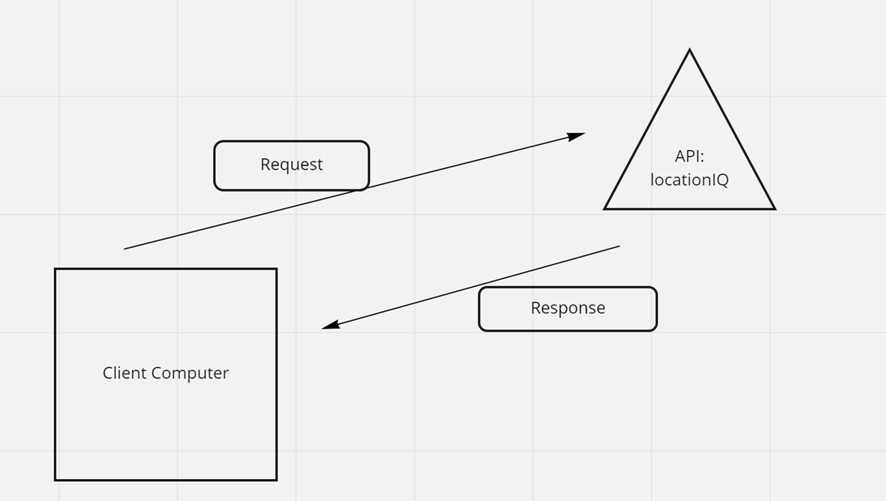

Project Name
Author: Dwight Lindquist

Overview
This product should allow a person to search for a city and then get a map of said city.

Getting Started
Architecture
WRRC

- The user's computer sends a REQUEST to the API endpoint, which contains a URL, access token, and query 
- The external server then sends back a response that holds data

WRRC Functions:

To handle input and put input in state
Use state data to make an asycronous Axios call
Change Log
V.1.0.0 - Search bar functionality and map population.

Credit and Collaborations