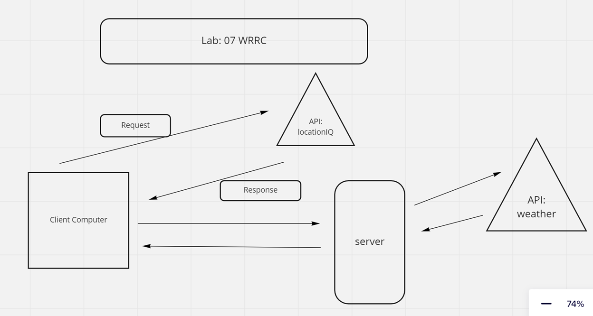

Project Name
Author: Dwight Lindquist

Overview
This product should allow a person to search for a city and then get a map of said city.

Getting Started
Architecture
WRRC

## old wrrc, from lab 6: 

## lab 7 wrrc, with Weather API: 

- The user's computer sends a REQUEST to the locationIQ API endpoint, which contains a URL, access token, and query 
- The external API server/endpoint then sends back a response that holds data
- the client then takes that data and sends a second API request via the server to the weather API. 
- the client then receives weather data via the response that routes through the server again 

V.1.0.0 - Search bar functionality and map population.

## This lab took roughly 6-7 hours to complete over a few days
## I expected it would take about this much time 

Credit and Collaborations